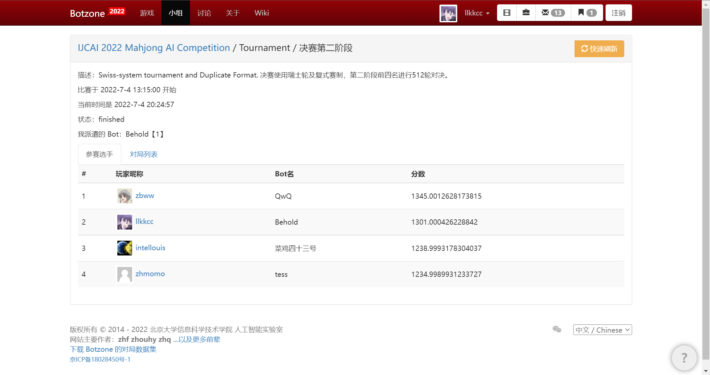
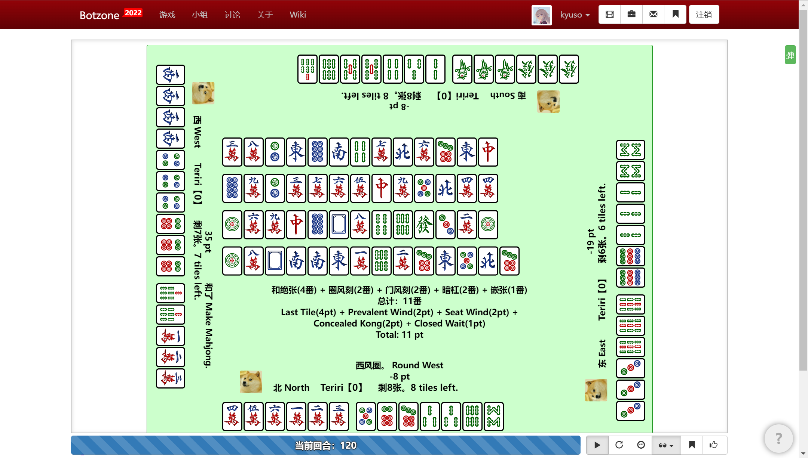

# 基于监督学习的国标麻将AI

根据[比赛](https://botzone.org.cn/static/gamecontest2022a_cn.html)所给的强AI对局数据，使用监督学习训练出一个AI。最终取得[IJCAI 2022 麻将人工智能比赛](https://botzone.org.cn/static/gamecontest2022a_cn.html)第二名。


<!-- PROJECT SHIELDS -->
## 配置
需要安装算番库[PyMahjongGB](https://github.com/ailab-pku/PyMahjongGB)

## 介绍
`data`中：
- `sample.txt`是样例数据，完整数据可从[这里](https://disk.pku.edu.cn:443/link/50B0147C4D98B2CF393B3AF1ADF53FBE
)下载，提取码`87Ok` 
- `3.pkl`是一个用`my_supervised_cnnmodel`训练好的模型，验证集上正确率 $86.9\%$
`new_model_try.py`中是使用的$resnet$模型
`feature.py`定义71维feature：
```python
OFFSET_OBS = {
    # 门风
    'SEAT_WIND' : 0,
    # 圈风
    'PREVALENT_WIND' : 1,
    # 自己的手牌
    'HAND' : 2,
    # 每个位置的弃牌
    'DISCARD' : 6,
    # 每个位置的副露
    'HALF_FLUSH' : 22,
    'CHI':22,
    'PENG':38,
    'GANG':54,
    # 向听数，用one-hot表示
    'SHANTEN':70
}
```
## 上手指南
```sh
# 先预处理
python preprocess.py
# 可以选用数据增强（万、条、筒互换，增加为原来的6倍）
python data_augment.py
# 训练
python my_supervised_cnnmodel.py
```
## 效果展示
- [botzone](https://botzone.org.cn/)上的bot-ID：`62c1a980b0a3930a9c03d252`
- [对局示例](https://botzone.org.cn/match/62c1c274b0a3930a9c03ed79)：



